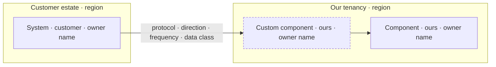

# Technical Account Plan — <Account> · <YYYY-MM-DD>

**Internal document.** Carrying cost, risk bands, bus-factor judgements and renewal exposure never
go to the customer, in any wording (`R18`).

**Run on:** <scope: full plan / quarterly refresh / handover pack / pre-renewal read> ·
<topology: our cloud / their VPC / self-hosted / hybrid> · data as-of <YYYY-MM-DD> ·
<one line naming anything taken as a default rather than answered>

---

## Renewal-critical technical facts

The two or three facts that decide this renewal. Nothing else goes above this line.

| # | Fact | Evidence | Resolve by | Before opt-out? | Owner (side) |
|---|---|---|---|---|---|
| 1 | | `[system · field · date]` | | yes / no | |
| 2 | | | | | |
| 3 | | | | | |

| | |
|---|---|
| ARR / opt-out deadline | $X · <date> (<N> days) — `renewal_date − notice_period_days` |
| Custom-work carrying cost | $X/yr (<Y>% of ARR) across <N> items |
| Open risks — Critical / High / Medium / Low | a / b / c / d |
| Bus factor (ours / theirs) | n / n |
| Plan confidence | High / Medium / Low — <criteria met> |

---

## 1. Deployment state

| Item | Contracted | Deployed | Active | Delta |
|---|---|---|---|---|

## 2. Architecture as deployed

| Environment | Region | Purpose | Owner | Promotion path | Config in VCS? |
|---|---|---|---|---|---|

| Data flow | Direction | Protocol | Frequency | Volume 30d | p50 / p95 | Data class | Residency | Owner (side) |
|---|---|---|---|---|---|---|---|---|

**Auth and identity**

| Element | Detail | Owner (side) | Expiry / review |
|---|---|---|---|
| Human SSO | | | |
| Provisioning (SCIM / manual) | | | |
| Tenancy model | | | |
| Service accounts | | | |
| Break-glass path | | | |

## 3. Integration inventory

| Integration | Direction | Auth | Credential expires | Last success | Consecutive fails | p95 | Volume trend | Owner (ours) | Owner (theirs) | RAG | Remediation |
|---|---|---|---|---|---|---|---|---|---|---|---|

## 4. Custom-work ledger

Generated by `../scripts/custom_work_ledger.py`.

| # | Item | Type | Built | Why | Maintainer | Blocks | Build cost | Carrying $/yr | Interest | Others hit it | Disposition | By |
|---|---|---|---|---|---|---|---|---|---|---|---|---|
| | **Total** | | | | | | $X | **$X/yr (<Y>% of ARR)** | | | | |

Above 5% of ARR, disposition is a commercial decision and goes to the account owner this week.

## 5. Version and sunset state

| Component | Deployed | Current | Majors behind | Support ends | Vendor sunset | Days to opt-out at that date | Upgrade owner (side) | Change window | Blockers |
|---|---|---|---|---|---|---|---|---|---|

## 6. Deployment risk register

Categories: technical · version · data · credential · key person · organisational · compliance ·
commercial. Ranked by impact band × days-to-trigger; ties broken in favour of the row whose trigger
date falls before the opt-out deadline.

| # | Risk | Category | Impact band | Early-warning signal | Owner (side) | Mitigation | Trigger date | Before opt-out? | Status |
|---|---|---|---|---|---|---|---|---|---|

## 7. Scale and headroom

| Resource | Current peak (90d) | Tested ceiling (test date) | Utilisation | Saturation signal | Errors | Growth rate | 80%-of-ceiling date | Owner |
|---|---|---|---|---|---|---|---|---|

## 8. Security, compliance and paper calendar

Generated by `../scripts/expiry_calendar.py`.

| Obligation | Kind | Status | Due | Act by | Days to opt-out at that date | Owner (side) |
|---|---|---|---|---|---|---|

## 9. Technical stakeholder map

| Name | Side | Role | What only they know | Reachable how | Bus-factor contribution | Second person who could do it |
|---|---|---|---|---|---|---|

## 10. Runbook — what breaks and what to do

| Symptom | First check | Remediation | Escalate to (named) | Entry last tested |
|---|---|---|---|---|

## 11. Checked and clear

Families and checks that came back with nothing to report. Printed, never dropped.

| Family | What was checked | Result |
|---|---|---|
| Product usage & adoption | | |
| Commercial & contract | | |
| Relationship & engagement | | |
| Support & reliability | | |
| Sentiment & VoC | | |
| Billing & payment | | |
| Firmographic & external | | |

## 12. The plan

One primary technical workstream this quarter (`R17`). Every row carries all five columns.

| # | Action | Owner (side) | By | Expected effect | Success measure |
|---|---|---|---|---|---|

**Not worked this quarter (`R14`)**

| Item | Why not | Revisit |
|---|---|---|

---

## What would change this plan

Two or three specific, observable events that would change the renewal-critical facts.

1.
2.
3.

## Coverage Ledger

`✅ Complete` = 1.0 · `⚠️ Partial` = 0.5 · `❌ Missing` = 0.

| Signal family | Source checked | Status | Notes |
|---|---|---|---|
| Product usage & adoption | | | |
| Commercial & contract | | | |
| Relationship & engagement | | | |
| Support & reliability | | | |
| Sentiment & VoC | | | |
| Billing & payment | | | |
| Firmographic & external | | | |

**Coverage: X / 7 (Y%) → confidence capped at <level>** (`R23`).
Blind spots: <which families are missing, and what those gaps typically hide in a deployment>.

## Assumptions

One row per default taken or gap filled. Every row names a concrete consequence — "may affect
results" is not a consequence.

| # | Assumption | Why it was needed | If wrong |
|---|---|---|---|
| 1 | | | |
| 2 | | | |
| 3 | | | |
