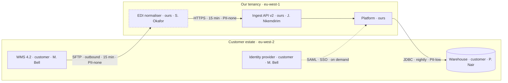

# Architecture As Deployed — drawing it, reviewing it, sizing it

> The design document describes what someone intended before they had touched the customer's
> data. This file is about what is actually running, which is a different system, and about the
> review that catches the difference before an incident does.
>
> Evidence labels follow the library convention: `[M]` measured · `[V]` vendor research ·
> `[P]` practitioner standard · `[A]` academic, standards body or regulation.

**Contents**
- [Why "as deployed" is a different document](#why-as-deployed-is-a-different-document)
- [The diagram](#the-diagram)
- [Environments and the promotion path](#environments-and-the-promotion-path)
- [Data flows and topology](#data-flows-and-topology)
- [The auth and identity model](#the-auth-and-identity-model)
- [Observability across the boundary](#observability-across-the-boundary)
- [Failure modes and blast radius](#failure-modes-and-blast-radius)
- [The scale envelope](#the-scale-envelope)
- [Cost at 1× and 10×](#cost-at-1-and-10)
- [Rollback](#rollback)
- [The review gate](#the-review-gate)
- [Product versus custom, marked on the diagram](#product-versus-custom-marked-on-the-diagram)
- [The eleven divergences to look for first](#the-eleven-divergences-to-look-for-first)

---

## Why "as deployed" is a different document

Every deployment drifts from its design, and the drift is where the risk lives. The design is
reviewed; the drift is not. Four mechanisms produce it, and all four are invisible in the design
doc:

| Mechanism | What it produces | How you find it |
| --- | --- | --- |
| Go-live pressure | An interim path that became permanent | Deploy history predating the go-live date |
| A customer constraint discovered late | A workaround nobody wrote down | Ticket text from the implementation window |
| Their own platform change | A component now pointing somewhere else | Config diff against the declared baseline |
| Staff turnover on either side | A component with no owner and no documentation | Authorship history; ask who was paged last |

**The rule:** every element of the diagram is either **verified** (you read it from the running
system in the last 30 days) or **inferred** (you were told, or you remember). Label them
differently. An inferred element in a plan someone acts on is the same failure as a fabricated
number in a risk brief.

## The diagram

Draw it in mermaid, in the plan file, so it diffs when it changes. A picture in a slide deck goes
stale silently; a picture in version control shows you the quarter it changed.

Conventions that make the diagram load-bearing rather than decorative:

| Element | Must carry | Example |
| --- | --- | --- |
| **Node** | System name · owning side · owner's name | `WMS (customer · M. Bell)` |
| **Edge** | Protocol · direction · frequency · data class | `SFTP · outbound · 15 min · PII-none` |
| **Boundary** | Tenancy and region | `subgraph EU-West · our tenancy` |
| **Custom element** | Marked distinctly, always | `:::custom` class, and a matching ledger row |
| **Unverified element** | Marked distinctly, always | `:::inferred`, plus the date you last confirmed it |



If the diagram cannot be drawn without a guess, the guess is a finding: write
`UNKNOWN — requires a config read on <system>` and leave the edge off. An edge drawn from memory
is worse than a missing edge, because the missing one prompts a question.

## Environments and the promotion path

| Question | Why it decides something |
| --- | --- |
| Which environments exist, by name? | Orphaned pilot environments hold live credentials and real customer data |
| Who can push to production, on each side? | An unbounded push list makes every change a production change |
| Is production configuration in version control? | Hand-edited production config is the most common undocumented dependency, and the first thing an upgrade breaks |
| How is a change promoted, and what gates it? | No gate means the rollback plan is the only safety mechanism |
| Do non-production environments carry production data? | A compliance finding and a breach-radius multiplier at once |
| When was a non-production environment last refreshed? | A stale staging environment tests nothing and gives false confidence before a cutover |

Record the answers even when they are uncomfortable. "Production config is hand-edited by two
people, no version control, verified 2026-08-26" is a plan; "config managed" is a sentence.

## Data flows and topology

One row per flow. The columns exist because each one has, on its own, blocked a renewal somewhere.

| Column | Why it is there |
| --- | --- |
| Direction | Inbound and outbound fail differently and are owned differently |
| Protocol and auth | Determines the credential that expires |
| Frequency and volume (30 d) | A flow's volume trend is the earliest adoption signal you have |
| Latency p50 / p95 | p95 is what the customer experiences and complains about |
| Data class | none / low / PII / special-category — decides residency and breach obligations |
| Residency and region | The constraint the architecture must honour, not the one the contract claims |
| Transformation | Where undocumented business logic hides |
| Retention | What must be deleted, when, and by whom |
| Owner, each side | The name that gets called |

**The two flows people forget:** logs and telemetry leaving the customer's estate, and backups or
exports leaving yours. Both carry data classes, both cross residency boundaries, and neither
appears on the design diagram.

## The auth and identity model

| Element | Record | Failure mode when it is not recorded |
| --- | --- | --- |
| Human SSO | Protocol, IdP, who administers the app registration | An IdP migration silently removes access for everyone |
| Provisioning | SCIM or manual, and what happens on deprovision | Leavers keep access; joiners wait a week and blame the product |
| Tenancy | Single-tenant, pooled, or per-region | Determines blast radius and the honest answer to their security questionnaire |
| Service accounts | Every one, with its scope, owner and rotation date | The dominant cause of a deployment failing at 04:00 with no code change |
| Machine credentials | Certificates, API keys, OAuth refresh tokens, signing keys | Each is a dated failure — see `../scripts/expiry_calendar.py` |
| Break-glass | Who can bypass, under what approval, logged where | An unlogged bypass path is an audit finding and a real risk |

**SSO/IdP decoupling is signal `T5` in `../../cs-context/references/signal-library.md`** — near
certain in strength, 30–90 day lead time. Confirm the innocent explanation (a genuine IdP
migration) before escalating, but escalate the *check* immediately.

## Observability across the boundary

The characteristic FDE blindness: your telemetry stops at the boundary, and the customer's starts
after it, so a failure in the gap is visible to neither party until a human notices missing data.

| Question | Good answer |
| --- | --- |
| Who sees a failed sync first? | A named alert route, on a named rota, tested in the last 90 days |
| What does the customer see? | A status surface they can check without opening a ticket |
| Is there an end-to-end check? | A synthetic transaction that traverses the whole path and alerts on absence |
| Are absence alerts configured? | Alerting on *no data* is what catches a silent stop; error-rate alerts never fire when nothing is sent |
| Where do their logs live, and can you read them during an incident? | Named system, named access path, requested before the incident |

Google's SRE practice defines toil as manual, repetitive, automatable work that scales linearly
with the service, and caps it at 50% of an engineer's time `[P]`. A deployment monitored by an
engineer remembering to check a dashboard is 100% toil and fails the first week they are on leave.

## Failure modes and blast radius

Walk each component and answer three questions. Anything you cannot answer is a risk-register row.

| Question | What a weak answer looks like |
| --- | --- |
| What happens when this component fails? | "It retries" — with what backoff, how many times, and then what? |
| Who and what is affected? | "Some users" — which tenants, which flows, how much of their volume |
| How does it recover — automatically or by hand? | "We'd fix it" — by whom, from what runbook, in how long |

**Single points of failure to check explicitly, every time:** one credential shared by every flow ·
one scheduled job with no dead-man alert · one person who can deploy · one network path with no
alternative · one region with no failover · one hand-maintained file that everything reads.

## The scale envelope

Use Brendan Gregg's USE method — for every resource, **utilisation, saturation and errors**
(ACM Queue, "Thinking Methodically about Performance", 2012) `[P]`. The point of the method is
completeness: it forces you to enumerate resources rather than investigate the one you suspect.

| Term | What to record | Why saturation matters most |
| --- | --- | --- |
| **Utilisation** | % of capacity busy, at peak, over 90 days | Reads comfortable right up to the cliff |
| **Saturation** | Queue depth, wait time, retry backlog, lag | Rises *before* utilisation pegs — this is the early warning |
| **Errors** | Error count and class over the same window | Rising errors at flat utilisation means a dependency, not capacity |

The envelope has to be a number and a date:

```
peak_now            = observed peak over the last 90 days
tested_ceiling      = the highest load actually tested, with the date it was tested
growth_rate         = (peak_now / peak_90d_ago) ^ (365/90) - 1     # annualised
date_at_80_percent  = the date growth_rate puts peak_now at 0.80 × tested_ceiling
```

Report `tested_ceiling` with its test date. An untested ceiling is a hope, and should be printed as
`UNKNOWN — requires a load test at <target>`. The 80% trigger is a convention, not a measurement
`[P]`: it exists so the conversation happens while there is still time to plan rather than during
an incident.

**Have the conversation early and in their units.** Not "we should look at capacity" but: "at your
current growth you cross 80% of the tested ceiling in March; the work to raise it is six weeks of
ours and a two-hour window of yours; here are the two dates that work."

## Cost at 1× and 10×

Cheap to compute, and it changes decisions. Model the deployment's run cost at current volume and
at ten times it: compute, storage, egress, per-call metering, and the human time in the runbook. A
component whose cost is linear in their growth and whose price to you is fixed is a margin problem
disclosed at the wrong time — surface it in the plan, not at the renewal.

## Rollback

For every change class, record what "undo" means and how long it takes.

| Change | Rollback | The question that finds the gap |
| --- | --- | --- |
| Config change | Previous version restored from source control | Is the previous version actually stored anywhere? |
| Schema change | Reverse migration, tested | Has the reverse migration ever been run? |
| Version upgrade | Previous release redeployed | Does the old release still work against the new data? |
| Model or prompt change | Previous snapshot re-pinned | Is there an eval suite that proves the rollback restored behaviour? |
| Data migration | Restore from a pre-migration snapshot | How old is the snapshot, and how long is the restore? |

A rollback plan that has never been executed is an assertion. Record the last date each one was
exercised, even in a non-production environment.

## The review gate

Run this before build, again before scale-up, and once a year. Score each line pass / concern /
fail; anything not passing is a risk-register row with an owner and a trigger date, not a note.

| # | Gate question | Fails when |
| --- | --- | --- |
| 1 | Is every node's owner a named human on a named side? | Any "the team" |
| 2 | Is every element verified within 30 days, or explicitly labelled inferred? | Unlabelled memory |
| 3 | Is production configuration reproducible from source control? | Hand-edited prod |
| 4 | Does every credential have an expiry date and a rotation owner? | Any undated credential |
| 5 | Is there an end-to-end absence alert on the critical path? | Error-only alerting |
| 6 | Is the tested ceiling known, with its test date? | An assumed ceiling |
| 7 | Has every rollback path been executed at least once? | Untested rollback |
| 8 | Is every custom element marked, and does it have a ledger row? | Custom work off the ledger |
| 9 | Does the architecture honour the contracted residency constraint? | A flow crossing a boundary the DPA forbids |
| 10 | Can a second engineer run this from the runbook alone? | Bus factor 1 |

## Product versus custom, marked on the diagram

Mark every custom element on the diagram itself, so the technical debt is visible in the picture
rather than only in a table nobody opens. The line to hold: **build on documented extension points,
never fork the product.** Extension points have an upgrade path and a support contract; a fork has
neither, and its carrying cost compounds with every release you ship. Pricing and disposition:
`custom-work-ledger.md`.

## The eleven divergences to look for first

Ranked by how often they turn out to be present and material.

| # | Divergence | How to detect it |
| --- | --- | --- |
| 1 | An interim integration path still live alongside its replacement | Two flows carrying the same data; check volumes on both |
| 2 | Production config hand-edited since the last deploy | Diff live config against the declared baseline |
| 3 | A component pointing at a system the customer has since migrated | Resolve every hostname in config; check for redirects and deprecation notices |
| 4 | Service accounts created for a migration and never removed | Enumerate accounts by creation date and last use |
| 5 | A scheduled job with no owner and no alert | List schedules; cross-reference the alert routing table |
| 6 | Non-production environments carrying production data | Sample row counts and check for real identifiers |
| 7 | A flow whose volume dropped to zero without a ticket | Volume trend per flow over 90 days |
| 8 | An undocumented transformation between source schema and their reports | Compare source fields to report fields |
| 9 | Pinned versions nobody remembers pinning | Version headers and SDK user agents against current |
| 10 | An entitlement contracted and never deployed | Order form against provisioned modules |
| 11 | A residency assumption the architecture quietly breaks | Trace every hop's region, including logs and backups |
